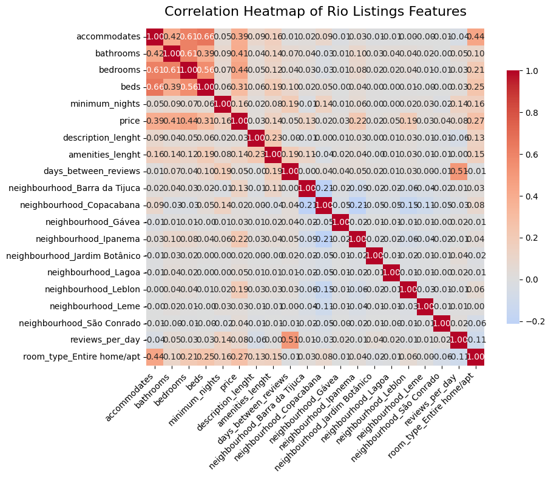
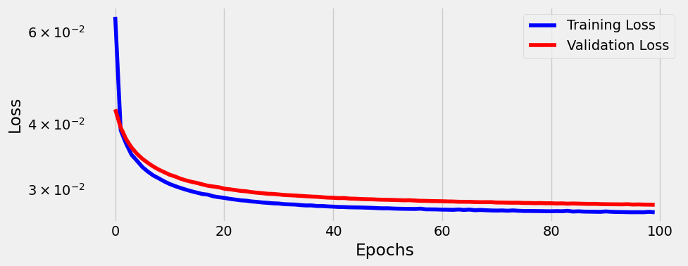
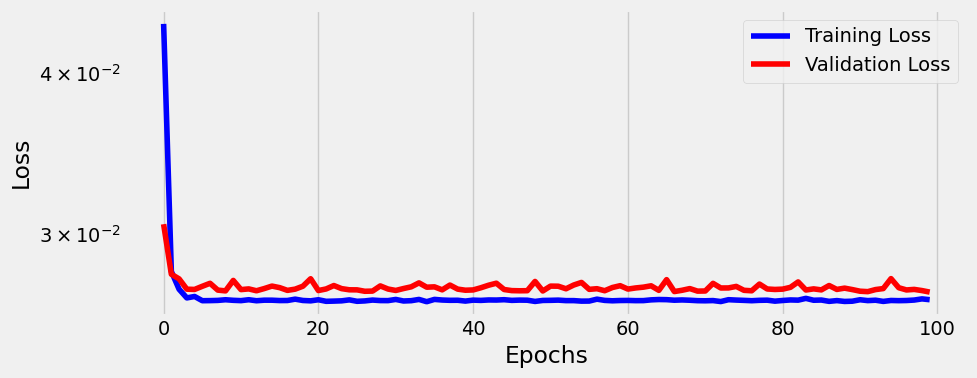

Este repositório contém o Projeto 1 para a disciplina de **Projeto de sistemas baseados em aprendizado de máquina**. O objetivo principal deste projeto é desenvolver um sistema de Machine Learning capaz de prever o preço de diárias de imóveis listados no Airbnb na cidade do Rio de Janeiro

---

## Objetivos

Melhorar os resultados obtidos em um problema de regressão (inside-airbnb)
1. Melhorar o EDA e seleção/criação de features;
2. Diferentes formas de normalização (e.g: min-max);
3. Modificação do algoritmo de otimização (e.g: adam, nadam, etc);
4. Outras estratégias que acharem pertinente mas mantendo o foco na regressão (e.g: LR diferentes, regularização, etc).

### Estrutura do Dataset

As features selecionadas para o modelo final foram:
* **accommodates**: Número de hóspedes que a propriedade acomoda.
* **bathrooms**: Número de banheiros.
* **bedrooms**: Número de quartos.
* **beds**: Número de camas.
* **price**: Preço da diária (variável alvo).
* **minimum_nights**: Número mínimo de noites necessárias para uma reserva

E incluindo:
* **description_lenght**: Número de caracteres na descrição do hotel.
* **amenities_lenght**: Quantidade de comodidades
* **days_between_reviews**: Quantidade de dias entre a primeira e ultimo review.
* **neighbourhood_Barra da Tijuca**: Se está localizado no Barra da Tijuca.
* **neighbourhood_Copacabana**: Se está localizado no Copacabana.
* **neighbourhood_Gávea**: Se está localizado no Gávea.
* **neighbourhood_Ipanema**: Se está localizado no Ipanema.
* **neighbourhood_Jardim Botânico**: Se está localizado no Jardim Botânico.
* **neighbourhood_Lagoa**: Se está localizado no Lagoa.
* **neighbourhood_Leblon**: Se está localizado no Leblon.
* **neighbourhood_Leme**: Se está localizado no Leme.
* **neighbourhood_São Conrado**: Se está localizado no 
* **reviews_per_day**: Média de reviews por dias.
* **room_type_Entire home/apt**: Se o tipo de acomodação é casa ou apartamento.

---

## Como Executar o Projeto

Para executar a análise contida no [notebook](https://github.com/lucasumb/Projeto-de-sistemas-baseados-em-aprendizado-de-maquina/blob/main/Projeto01/notebooks), siga os passos abaixo:

**1. Pré-requisitos:**
-   Python 3.x
-   Jupyter Notebook ou Google Colab

**2. Dependências:**
As principais bibliotecas utilizadas são:
-   `pandas`
-   `numpy`
-   `torch`
-   `matplotlib`
-   `seaborn`
-   `scikit-learn`
-   `lazypredict` (utilizada para exploração de modelos, embora o código final esteja comentado).

---

## Resultados

O dataset original (42k+ entradas) foi reduzido para ~19k após uma limpeza rigorosa de outliers utilizando o método IQR (Interquartile Range), garantindo que o modelo não fosse enviesado por propriedades de luxo ou erros de cadastro. Com isso, fiz um heatmap com a correlação com a variavel Preço.

Após remover a variavel Preço do target, usando o modelo sequencial linear (PyTorch) treinado por 100 épocas, tanto com SDG como Adam, consecutivamente, obtivemos esses resultados:

Comparando os otimizadores de SDG e Adam:

- SGD: RMSE de 153.68
- Adam: RMSE de 152.50 (Melhor performance)

O modelo final, utilizando o otimizador Adam e normalização Min-Max, atingiu um RMSE de R$ 152,50 nos dados de teste, demonstrando capacidade de generalização após a remoção de ruídos e normalização dos dados.