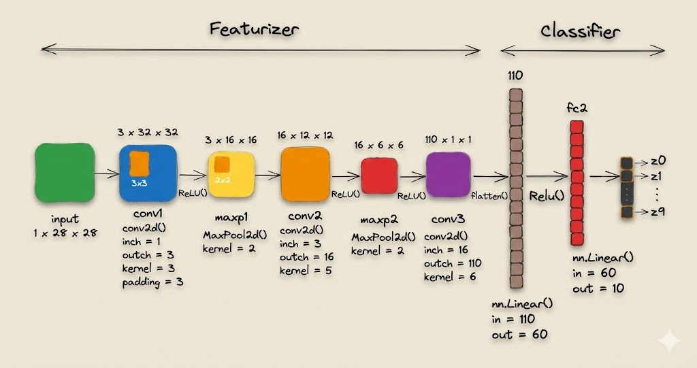
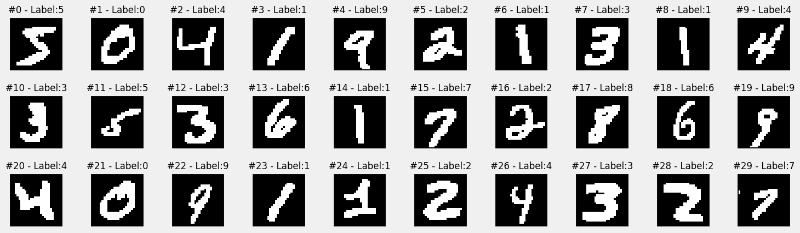
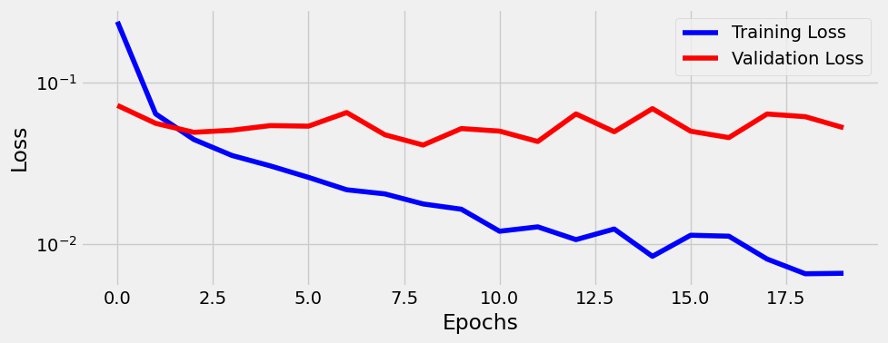
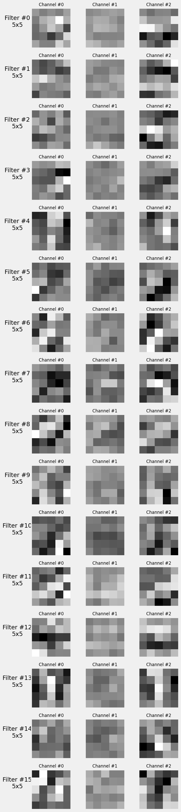
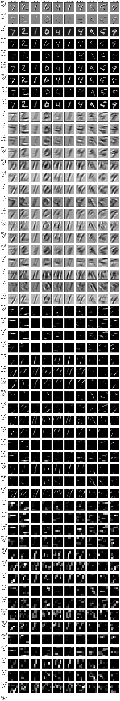
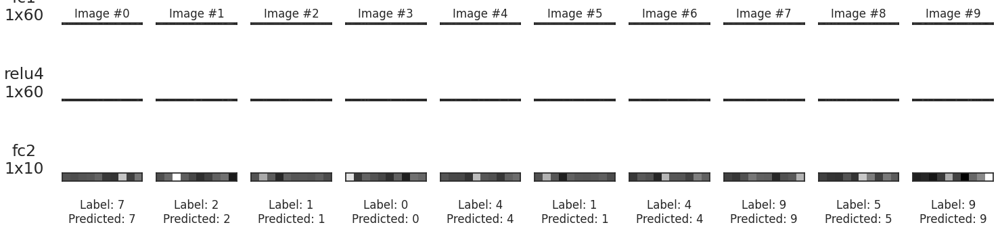

Este projeto vale 10,0 pontos para a Unidade 2.
Este projeto apresenta a implementação de uma Rede Neural Convolucional (CNN) utilizando a biblioteca PyTorch. O objetivo principal foi desenvolver uma estrutura de treinamento modular e implementar mecanismos para visualizar o funcionamento interno da rede através do uso de Hooks do PyTorch.

---

## Objetivos

1) Escolher um dataset do torchvision.datasets (≠ CIFAR10). 
2) Manter a arquitetura-base (LeNet-like) como visto em aula, adaptando apenas in_channels se necessário. 
3) Treinar o modelo e registrar métricas de loss e accuracy (treino/val).  
4) Implementar Hooks para capturar ativações intermediárias.
5) Visualizar os feature maps de todas camadas.
6) Escrever uma breve análise (1–2 parágrafos) sobre o que foi observado.
7) Gravar um vídeo de até 10min sobre o que foi observado.
8) Organizar um repositório no Github com tudo o que foi desenvolvido, incluindo um arquivo README.md descrevendo todo o trabalho em detalhes.

---

## Como Executar o Projeto

Para executar a análise contida no [notebook](https://github.com/lucasumb/Projeto-de-sistemas-baseados-em-aprendizado-de-maquina/tree/main/Projeto02/notebooks), siga os passos abaixo:

**1. Pré-requisitos:**
-   Python 3.x
-   Jupyter Notebook ou Google Colab

**2. Dependências:**
As principais bibliotecas utilizadas são:
-   `torch`
-   `torchvision`
-   `matplotlib`
-   `numpy`

---

## Resultados

Primeiramente, decidi utilizar o dataset MNIST, que é composto por várias imagens com escritas que variam entre os números 0 e 9, ou seja, teremos 10 classes como saída, as quais serão abordadas mais à frente. Em relação ao modelo, fiz leves alterações referentes à arquitetura LeNet disponibilizada pelo professor, principalmente para testar meus conhecimentos sobre como montar e aplicar a fórmula para obter os valores das convoluções:

$$
\text{Output} = \left\lfloor \frac{n + 2p - k}{s} + 1 \right\rfloor
$$

Com isso, utilizei este modelo para minha CNN.Com isso, utilizei este modelo para minha CNN.

Em relação ao dataset utilizado, como foi dito anteriormente, fiz uso do **MNIST**. Abaixo, podem ser visualizados alguns dos exemplos utilizados para compor os dados de **treinamento**.

Com o modelo e os dados prontos, a execução com o valor de 20 épocas foi bem estável e sem tantas subidas ou descidas abruptas.

Após isso, conseguimos visualizar os filtros utilizados na primeira convolução e na segunda convolução, **respectivamente** nesta ordem:

Em seguida, utilizei o `attach_hooks` para obter a visualização das `python featurizer_layers = ['conv1', 'relu1', 'maxp1', 'flatten']` e `python classifier_layers = ['fc1', 'relu4', 'fc2']`. Assim, obtive os seguintes gráficos consecutivamente:

Ao visualizar as saídas das camadas, foi possível observar a transformação da informação. As convoluções iniciais mantiveram a estrutura dos dígitos, enquanto as próximas convoluções tornaram-se mais abstratas e esparsas, provavelmente focando na presença de características necessárias para a classificação final. Por fim, foram encontrados estes resultados das métricas pedidas:

- Latest Training Loss: 0.0066
- Latest Validation Loss: 0.0526
- Training Accuracy: 99.83%
- Validation Accuracy: 98.79%

### Video explicativo

* [Parte 1]()

* [Parte 2]()

